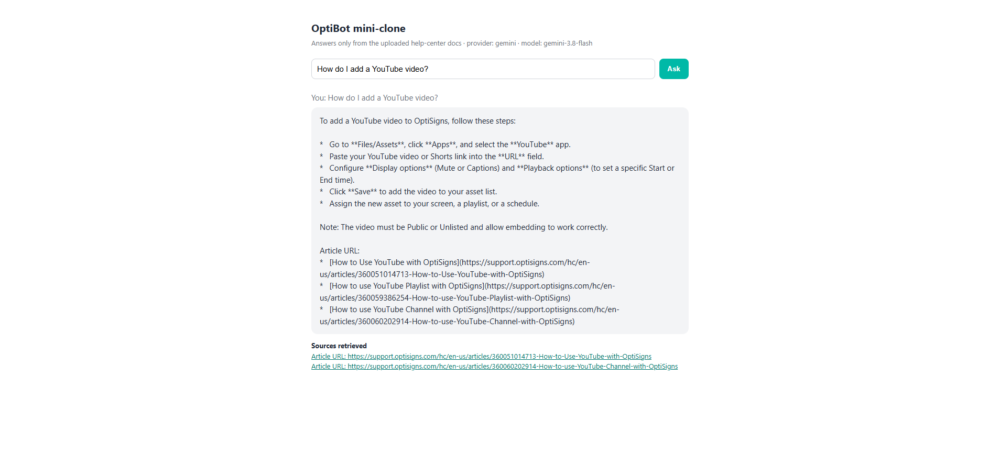

# kb-sync — OptiBot mini-clone

Scrapes the OptiSigns help center to Markdown and keeps a **Gemini File Search** store in sync by
uploading **only what changed**. Runs once, exits 0, scheduled daily. OpenAI adapter behind a flag.

```
Zendesk API ──> docs/<slug>.md ──> diff vs. per-document metadata ──> upload delta ──> SUMMARY
```

**Video:** [`media/kb-sync-demo.mp4`](media/kb-sync-demo.mp4) · **Job logs:** [all `daily-sync` runs](https://github.com/lamhaohtc/MiniChatbot/actions/workflows/daily-sync.yml), [latest green run](https://github.com/lamhaohtc/MiniChatbot/actions/runs/36835682521) · **Real run logs:** [`runs/`](runs/)

## Setup and run

```bash
python -m venv .venv
source .venv/bin/activate                # Windows: .venv\Scripts\activate
pip install -r requirements-dev.txt
cp .env.sample .env                      # add GEMINI_API_KEY (aistudio.google.com -> Get API key)
python main.py --scrape-only             # 416 articles -> docs/, no key needed
python main.py --dry-run                 # show added/updated/skipped/removed, upload nothing
python main.py                           # full sync: prints SUMMARY, writes artifacts/last_run.json
python ask.py "How do I add a YouTube video?"   # grounded answer + cited Article URLs
python serve.py                          # same in a browser at http://127.0.0.1:8765
pytest                                   # 28 tests: cleaning, chunk maths, delta logic
docker build -t kb-sync . && docker run --rm -e API_KEY=... -e VECTOR_STORE_ID=... kb-sync
```

`API_KEY` is accepted as an alias for `GEMINI_API_KEY`. The first run logs
`created file search store fileSearchStores/...`; set it as `VECTOR_STORE_ID` so later runs reuse it
(otherwise the job finds the store by `VECTOR_STORE_NAME`). A run ends with one line, for example:

```
SUMMARY added=0 updated=1 skipped=415 removed=0 files_embedded=1 chunks_embedded=3 failed=0 store_files=416 store_chunks=1012 (26.5s)
```

## How it works

- **Scrape and clean.** Zendesk Help Center API, paginated; drafts dropped. BeautifulSoup strips
  nav/ads/scripts, absolutises links and images, drops inline base64 images (one article carried
  125 KB on one line), turns embeds into links, keeps fenced code with language hints. Every file
  starts with front matter and a plain `Article URL:` line so any retrieved chunk can be cited.
- **Chunking.** Gemini white-space strategy, **400 tokens / 80 overlap**: a help article is a short
  step list, 400 tokens is about one procedure, and the overlap keeps numbered steps from being
  split. The API exposes no chunk count, so the same sliding window is replicated locally
  (`optibot/chunking.py`). Store today: **416 files, 1 012 chunks**. OpenAI adapter: 800/400.
- **Delta detection.** The store is the only state. Each document carries `custom_metadata`
  (`article_id`, `content_hash`, `slug`, `source_url`); every run lists the store, rebuilds the
  manifest, and compares a SHA-256 of the rendered Markdown. `updated_at` is ignored because it
  bumps on label edits. `added` → upload · `updated` → delete + upload · `skipped` → nothing ·
  `removed` → delete. A stateless container is therefore idempotent.
- **Daily job.** `.github/workflows/daily-sync.yml` runs the Docker image at `0 3 * * *` UTC with
  the secrets and uploads `last_run.json` as an artefact; `railway.json` carries the same schedule.
  Committed logs in [`runs/`](runs/): initial load (413 added, 1 fixed next run), no-op
  (`skipped=416`), simulated edit (`updated=1`).
- **Assistant.** Verbatim system prompt from the brief + Gemini `file_search` over the store
  (`ask.py`, `serve.py`). AI Studio has no File Search UI, so `serve.py` stands in for the
  Playground; citations come from each chunk's `source_url` metadata. `GEMINI_MODEL` is a fallback
  list for 503/404.



## Layout

```
main.py  ask.py  serve.py        entry point · terminal Q&A · local chat page
optibot/zendesk.py markdown.py   scrape · HTML->Markdown, slug, hash, front matter
optibot/store_gemini.py store.py Gemini File Search adapter (default) · OpenAI adapter
optibot/sync.py chunking.py      pure delta planner + applier · local chunk counter
tests/  docs/  runs/  media/     28 tests · 416 generated files · real run logs · video
```

Part 2 of the take-home, the SCIO clone plan, is submitted separately; a copy lives in [`plan/`](plan/).
